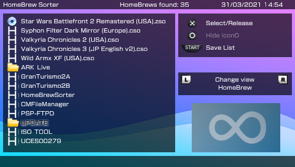

# HomeBrew Sorter

## Credits
HomeBrew Sorter by Sakya
GUI & compatibility with game categories by Valantin and suloku
nuOSLibMOD V2 ([GitLab](https://gitlab.com/HaydenKow/nuoslibmod-v2))

## File extensions supported
- ZSO
- DAX
- CSO
- ISO
- PBP (EBOOT)

## Current detected paths
- `ms0:/PSP/GAME`
- `ms0:/PSP/GAME/PSX`
- `ms0:/PSP/GAME/Utility`
- `ms0:/PSP/GAME150`
- `ms0:/ISO`
- `ms0:/ISO/PSP`
- `ms0:/ISO/VIDEO`

## To do
- [ ] Add support for [game categories lite](https://github.com/ticky/game-categories-lite)
- [ ] Automatically detect paths in `/ISO` and `/PSP/GAME`
- [ ] Auto scrolling when the file name is too long
- [ ] Battery percentage indicator
- [ ] New icons/images

## Build
Build with [PSP toolchain](https://github.com/pspdev/psptoolchain) or [pspdev docker](https://github.com/pspdev/pspdev-docker)